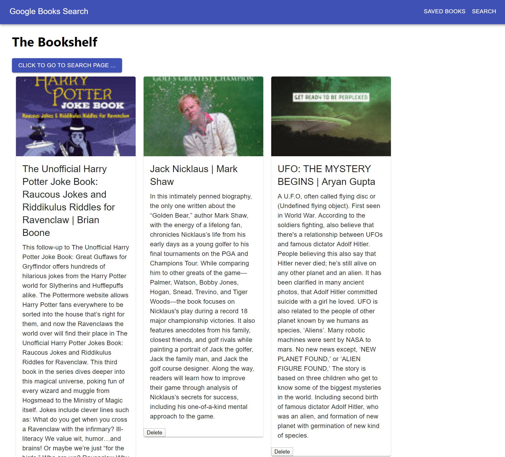

## Google Books API Search

## Purpose

This is a MERN (MongoDB, ExpressJS, ReactJS, NodeJS) application that allows users to query the Google Books API and save books to their own bookshelf.

## Usage

Users simply enter a book title into the search box on the home screen and click or tap "Submit" button to see 10 results from Google. Users can then add those titles to their saved list (bookshelf) by clicking the "Add" button in the book card. 

Navigating to the Bookshelf via the Saved Books link in the top right of the navbar, users can then view all their saved titles and remove ones they no longer want to keep with the "Delete" button in the book card. Users can return to the home page by clicking either the Search link in the navbar or the "Click to go to search page" button at the top of the bookshelf page.

Future functionality will include the ability for users to click a "View" button on the book card and view the book on Google Books.

### Screenshot

#### GitHub Repo

https://github.com/tdj03001/search-goog-books/

#### Live Site

https://searchgoogbooks.herokuapp.com/
